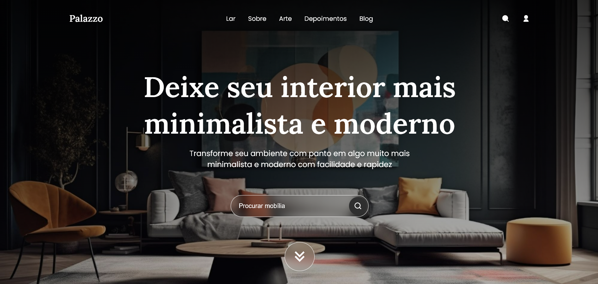

# 🛋️ Palazzo - E-commerce de Móveis Minimalistas

()

## 📋 Sobre o Projeto

Palazzo é um e-commerce sofisticado focado em móveis minimalistas de luxo. O projeto foi desenvolvido com ênfase em design elegante e experiência do usuário premium, utilizando tecnologias web modernas para criar uma plataforma de compras intuitiva e visualmente atraente.

### ✨ Características Principais

- Design minimalista e sofisticado
- Interface responsiva para todos os dispositivos
- Animações suaves e interativas
- Sistema de navegação intuitivo
- Carrossel de depoimentos
- Seção de blog integrada
- Newsletter personalizada
- Sistema de busca de produtos

## 🚀 Tecnologias Utilizadas

- **HTML5**
  - Semântica moderna
  - SEO otimizado
  - Estrutura limpa e organizada

- **CSS3**
  - Flexbox e Grid Layout
  - Variáveis CSS personalizadas
  - Animações e transições
  - Media Queries para responsividade
  - Mobile-first approach

- **JavaScript**
  - Manipulação avançada do DOM
  - Scroll Reveal para animações
  - Swiper.js para carrosséis
  - Eventos personalizados

## 💻 Pré-requisitos

Para rodar este projeto localmente, você precisará apenas de:

- Um navegador moderno
- Um editor de código (recomendo VS Code)
- Conexão com internet (para carregar as fontes e ícones)

## 🔗 Link do Projeto 

- https://ecomm-housemoveis.vercel.app/

## 🎯 Como Usar

1. Clone este repositório:
```bash
git clone https://github.com/kleyam/palazzo-ecommerce.git
```

2. Navegue até o diretório do projeto:
```bash
cd palazzo-ecommerce
```

3. Abra o arquivo `index.html` em seu navegador ou use uma extensão como Live Server no VS Code.

## 📱 Responsividade

O projeto é totalmente responsivo, com breakpoints em:
- 1200px (Desktop)
- 900px (Tablet)
- 600px (Mobile)

## 🎨 Paleta de Cores

```css
:root {
    --primary-color: #2f2f2f;
    --text-dark: #18181b;
    --text-light: #71717a;
    --white: #ffffff;
}
```

## 📚 Estrutura do Projeto

```
palazzo-ecommerce/
│
├── assets/
│   ├── images/
│   ├── favicon.ico.png
│   └── style.css
│
├── index.html
├── main.js
└── README.md
```

## ⚡ Performance

O site foi otimizado para:
- Carregamento rápido
- Animações suaves
- Código limpo e eficiente
- Assets otimizados

## 🤝 Contribuindo

Contribuições são sempre bem-vindas! Para contribuir:

1. Faça um Fork do projeto
2. Crie uma Branch para sua Feature (`git checkout -b feature/AmazingFeature`)
3. Adicione suas mudanças (`git add .`)
4. Commit suas mudanças (`git commit -m 'Add some AmazingFeature'`)
5. Push para a Branch (`git push origin feature/AmazingFeature`)
6. Abra um Pull Request

## 📫 Contato

Sinta-se à vontade para me contatar:

[](https://www.linkedin.com/in/kleyam-guthierrez-ba3b61234/)
[](https://github.com/Kleyam)

## 📝 Licença

Este projeto está sob a licença MIT. Veja o arquivo [LICENSE](LICENSE) para mais detalhes.

---

⭐️ From [Kleyam Guthierrez](https://github.com/kleyam)
